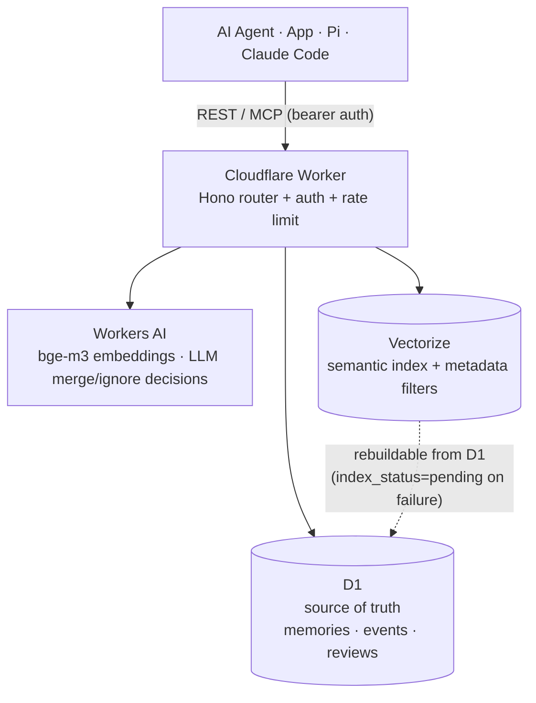

<div align="center">

# 🧠 Asaki Memory Manager

**A Cloudflare-native long-term memory layer for AI agents.**

Give your coding agents durable memory — preferences, project conventions, decisions, bug fixes, and workflows — without a Docker stack or an external vector database. Just Workers, D1, and Vectorize.

[](https://workers.cloudflare.com/)
[](https://hono.dev/)
[](https://www.typescriptlang.org/)
[](LICENSE)

[Quick start](#quick-start) · [Architecture](#architecture) · [Integrations](#integrations) · [API](#api-reference) · [Configuration](#configuration) · [Security](#security)

</div>

---

## Why

AI coding agents are far more useful when they remember. But most memory stacks mean standing up a vector DB, a queue, and a service to babysit. Asaki Memory Manager is a **single-operator, self-hosted** alternative that runs entirely on your Cloudflare account: the Worker is the API, D1 is the source of truth, and Vectorize is a recoverable semantic index. No servers to run, no data leaving your account.

> **Single-operator by design** — this is a personal memory layer, not a multi-tenant/team product. Every query is scoped to one `user_id`.

## Features

- **Cloudflare-native** — Workers + D1 + Vectorize + Workers AI. Nothing else to host.
- **REST-first, MCP-ready** — a small HTTP API, plus the same tool surface served over remote MCP straight from the Worker.
- **Scoped memory** — `global` / `project` / `session` with strict project & session isolation.
- **Hybrid retrieval** — Vectorize semantic search fused with a D1 lexical fallback, so search still works when AI/Vectorize are down.
- **Two capture paths** — agents submit pre-distilled candidates, *or* hand raw text to a server-side LLM extractor. Either way Cloudflare dedupes, merges, indexes, and stores.
- **Human-in-the-loop** — unsupervised background classifiers never auto-write; their candidates land in a review queue you approve via a `/memory` audit.
- **Deterministic dedup guards** — exact, subset, and technical-token paraphrase checks run *before* any LLM decision.
- **Self-improving** — a regression-eval harness (`eval:extraction`, `eval:classifier`) turns every audit miss into a permanent few-shot test case.
- **First-class agent integrations** — a Claude Code plugin, a Pi extension, and a stdio MCP server for Codex.

## Architecture



**D1 is the source of truth; Vectorize is an index.** If a vector upsert fails, the memory is still stored and marked `index_status=pending` for later backfill — no write is ever lost to an indexing hiccup.

## Quick start

<details open>
<summary><b>Prerequisites</b></summary>

- A Cloudflare account with Workers, D1, Vectorize, and Workers AI enabled
- Node.js 20+ and the `wrangler` CLI (installed via `npm install`)

</details>

```bash
# 1. Install
npm install

# 2. Create Cloudflare resources
npx wrangler login
npx wrangler d1 create asaki-memory-manager
npx wrangler vectorize create asaki-memory-manager --dimensions 1024 --metric cosine
for p in user_id scope project_id session_id kind; do
  npx wrangler vectorize create-metadata-index asaki-memory-manager --propertyName "$p" --type string
done

# 3. Configure Wrangler (then set your D1 database_id in wrangler.jsonc)
cp wrangler.example.jsonc wrangler.jsonc

# 4. Apply migrations
npm run db:migrate:local
npm run db:migrate:remote

# 5. Set the required API auth secret
npx wrangler secret put ADMIN_API_KEY

# 6. Run locally
npm run dev
curl http://127.0.0.1:8787/health

# 7. Deploy
npm run deploy
```

> `wrangler.jsonc` is gitignored — only `wrangler.example.jsonc` is tracked. Never commit your real config.

## Integrations

### Claude Code

Distributed as a self-contained plugin — no manual `settings.json` hook/MCP editing, no absolute paths (everything resolves via `${CLAUDE_PLUGIN_ROOT}`), and the MCP tools come from the **remote** Worker endpoint, so there's no local process or repo checkout to maintain.

```bash
claude plugin marketplace add Asaki14/asaki-memory-manager
claude plugin install asaki-memory@asaki-memory
```

Set your credentials once in `~/.claude/settings.json`:

```json
{
  "env": {
    "ASAKI_MEMORY_API_KEY": "your-admin-api-key",
    "ASAKI_MEMORY_BASE_URL": "https://your-worker.your-subdomain.workers.dev"
  }
}
```

The plugin injects a real project-history digest at session start, a per-turn memory precheck so the agent decides for itself whether to search, a visible `🧠 Asaki memory …` line whenever a memory tool runs, and a `/memory` slash command (`/memory status` checks connectivity; any other args run a full audit). A background Stop hook also runs a local classifier: with cloud auto-extract off (the default), it judges each conversation delta against a 6-criteria checklist and writes qualifying candidates itself over plain HTTP — no forced extra turn. Full details: [`integrations/claude-code/README.md`](integrations/claude-code/README.md).

### Pi

Pi doesn't support remote MCP, so it ships as a self-contained single-file extension, published as a standalone npm package:

```bash
pi install npm:@asaki14/pi-memory
```

On every `session_start` it renders a compact, transcript-local `[Memory]` status banner (user, project, memory count, pending reviews, auto-extract/classifier state). It appears with Pi's startup resource information, scrolls away with the conversation, and does not enter LLM context. On `agent_end` it runs a background classifier that pre-distills one candidate and writes it to the review queue — throttled, and skipping anything that trips the sensitive-text gate.

<details>
<summary><b>Common Pi environment variables</b></summary>

```bash
export ASAKI_MEMORY_API_URL="https://your-worker.your-subdomain.workers.dev"
export ASAKI_MEMORY_API_KEY="your-admin-api-key"
export ASAKI_MEMORY_USER_ID="alice"
export ASAKI_MEMORY_PROJECT_ID="demo-app"
export ASAKI_MEMORY_AUTO_INJECT="1"
export ASAKI_MEMORY_AUTO_MIN_SCORE="0.67"
export ASAKI_MEMORY_AUTO_EXTRACT="0"
export ASAKI_MEMORY_AUTO_CLASSIFIER="1"
export ASAKI_MEMORY_CLASSIFIER_MODEL="openai-codex/gpt-5.6-luna"
export ASAKI_MEMORY_EXTRACT_MIN_INTERVAL_SECONDS="300"
```

The classifier model can also be set via `classifierModel` in `~/.pi/agent/asaki-memory.json`. When `ASAKI_MEMORY_AUTO_EXTRACT=1`, Pi instead sends only user/assistant text (no tool calls/results/thinking) to `/v1/memories/extract` for server-side extraction.

</details>

The extension exposes `asaki_memory_search`, `asaki_memory_add`, `asaki_memory_list`, `asaki_memory_update`, `asaki_memory_delete`, `asaki_memory_review_create`, `asaki_memory_review_list`, `asaki_memory_review_resolve`, and the `/memory` command.

### MCP

The same tool surface is served two ways:

- **Remote (recommended)** — `src/mcp.ts` serves MCP over HTTP at `POST /mcp`, guarded by the same `ADMIN_API_KEY` bearer as `/v1/*`. Clients like Claude Code need **no local process** — just the Worker URL + bearer. `project_id` is passed explicitly (no git root on the Worker); `user_id` defaults to `ASAKI_MCP_DEFAULT_USER_ID` (or `asaki`).
- **Local stdio** — `integrations/mcp/asaki-memory.ts` (bundled to `dist/mcp-server.mjs`) is a standalone stdio server for clients that need a local process, e.g. Codex. See [`integrations/codex/README.md`](integrations/codex/README.md).

## API reference

All `/v1/*` endpoints require a bearer token. If `ADMIN_API_KEY` is unset, every `/v1/*` route returns `503`.

```http
Authorization: Bearer <ADMIN_API_KEY>
```

<details>
<summary><code>POST /v1/memories</code> — create a memory</summary>

```bash
curl -X POST http://127.0.0.1:8787/v1/memories \
  -H 'Content-Type: application/json' \
  -H "Authorization: Bearer $ADMIN_API_KEY" \
  -d '{
    "content": "Use Cloudflare Workers, D1, and Vectorize for this project.",
    "user_id": "alice",
    "scope": "project",
    "project_id": "demo-app",
    "kind": "decision",
    "importance": 0.8,
    "confidence": 0.95
  }'
```

</details>

<details>
<summary><code>POST /v1/memories/search</code> — semantic + lexical search</summary>

```bash
curl -X POST http://127.0.0.1:8787/v1/memories/search \
  -H 'Content-Type: application/json' \
  -H "Authorization: Bearer $ADMIN_API_KEY" \
  -d '{
    "query": "What stack should this project use?",
    "user_id": "alice",
    "project_id": "demo-app",
    "top_k": 5
  }'
```

Defaults to `global + current project + current session` when `project_id` / `session_id` are provided. Explicit `scope=project` requires `project_id`; explicit `scope=session` requires `session_id`. Optional `min_score` (0–1) drops low-scoring results.

</details>

<details>
<summary><code>POST /v1/memories/list</code> — list memories</summary>

```bash
curl -X POST http://127.0.0.1:8787/v1/memories/list \
  -H 'Content-Type: application/json' \
  -H "Authorization: Bearer $ADMIN_API_KEY" \
  -d '{
    "user_id": "alice",
    "project_id": "demo-app",
    "status": "active",
    "limit": 50,
    "offset": 0
  }'
```

Omit `scope` to list `global + current project + current session`. Use `status=all` to include archived and deleted memories.

</details>

<details>
<summary><code>GET /v1/memories/:id</code> · <code>PATCH /v1/memories/:id</code> — get / update</summary>

```bash
# Get
curl "http://127.0.0.1:8787/v1/memories/<memory-id>?user_id=alice" \
  -H "Authorization: Bearer $ADMIN_API_KEY"

# Update
curl -X PATCH http://127.0.0.1:8787/v1/memories/<memory-id> \
  -H 'Content-Type: application/json' \
  -H "Authorization: Bearer $ADMIN_API_KEY" \
  -d '{
    "user_id": "alice",
    "content": "Use Cloudflare Workers, D1, Vectorize, and Workers AI for this project.",
    "importance": 0.85
  }'
```

</details>

<details>
<summary><code>DELETE /v1/memories/:id</code> · <code>POST /v1/memories/:id/purge</code> — delete / purge</summary>

```bash
# Soft delete: row marked status=deleted, content retained & recoverable
curl -X DELETE http://127.0.0.1:8787/v1/memories/<memory-id> \
  -H 'Content-Type: application/json' \
  -H "Authorization: Bearer $ADMIN_API_KEY" \
  -d '{"user_id":"alice"}'

# Purge: irreversible — wipes content, removes Vectorize entry, deletes all
# prior memory_events, logs one content-free purge event
curl -X POST http://127.0.0.1:8787/v1/memories/<memory-id>/purge \
  -H 'Content-Type: application/json' \
  -H "Authorization: Bearer $ADMIN_API_KEY" \
  -d '{"user_id":"alice","reason":"accidentally stored a credential"}'
```

Use **purge**, not delete, for content that should never have been stored.

</details>

<details>
<summary><code>POST /v1/memories/candidates</code> — process candidates (dedupe/merge pipeline)</summary>

```bash
curl -X POST http://127.0.0.1:8787/v1/memories/candidates \
  -H 'Content-Type: application/json' \
  -H "Authorization: Bearer $ADMIN_API_KEY" \
  -d '{
    "user_id": "alice",
    "project_id": "demo-app",
    "candidates": [
      {
        "content": "The demo-app project uses Cloudflare Workers and D1.",
        "scope": "project",
        "kind": "decision",
        "importance": 0.8,
        "confidence": 0.9
      }
    ]
  }'
```

Agents extract durable memories from their own context and submit concise candidates here — the Worker does not accept full transcripts for extraction. Candidates from an unsupervised background classifier (`source: "pi:agent-end-classifier"` or `"claude-code:stop-classifier"`) always land in `reviews`, never `decisions`: only a human-in-the-loop write can auto-add/merge/update/delete.

</details>

<details>
<summary><code>POST /v1/memories/reviews</code> · <code>.../reviews/list</code> · <code>.../reviews/:id/resolve</code> — review queue</summary>

```bash
# Enqueue a high-risk candidate for review
curl -X POST http://127.0.0.1:8787/v1/memories/reviews \
  -H 'Content-Type: application/json' \
  -H "Authorization: Bearer $ADMIN_API_KEY" \
  -d '{
    "user_id": "alice",
    "project_id": "demo-app",
    "candidates": [
      { "content": "Use review queue for high-risk global rules.",
        "scope": "project", "kind": "workflow",
        "importance": 0.6, "confidence": 0.8 }
    ]
  }'

# List pending reviews (add "include_suggestions": true for duplicate hints)
curl -X POST http://127.0.0.1:8787/v1/memories/reviews/list \
  -H 'Content-Type: application/json' \
  -H "Authorization: Bearer $ADMIN_API_KEY" \
  -d '{"user_id":"alice","project_id":"demo-app","status":"pending"}'

# Resolve a review
curl -X POST http://127.0.0.1:8787/v1/memories/reviews/<review-id>/resolve \
  -H 'Content-Type: application/json' \
  -H "Authorization: Bearer $ADMIN_API_KEY" \
  -d '{"user_id":"alice","action":"add","reason":"approved"}'
```

Resolve actions: `add`, `merge`, `update`, `delete`, `ignore`. `merge`/`update`/`delete` require `memory_id`.

</details>

## Configuration

| Variable | Default | Purpose |
| --- | --- | --- |
| `ADMIN_API_KEY` | *unset* | **Required** bearer auth for `/v1/*` and `/mcp`; unset returns `503`. Set as a Wrangler secret. |
| `EMBEDDING_MODEL` | `@cf/baai/bge-m3` | Workers AI embedding model (1024-dim). |
| `MEMORY_LLM_MODEL` | `@cf/meta/llama-3.1-8b-instruct-fp8` | Workers AI chat model for candidate merge/ignore decisions. |

## Data model

| Table | Purpose |
| --- | --- |
| `memories` | Memory body, scope, project/session metadata, kind, importance, confidence, status, index state. |
| `memory_events` | Append-only operational event log. |
| `memory_reviews` | Pending and resolved candidate review queue. |

**Memory kinds:** `preference` · `rule` · `fact` · `decision` · `task_learning` · `bug_fix` · `workflow`

## Security

- Never commit `.env`, `.dev.vars`, private keys, tokens, or generated `wrangler.jsonc`. Use `wrangler.example.jsonc` as the public template and store `ADMIN_API_KEY` via `npx wrangler secret put`.
- Every query is filtered by `user_id`. Project/session memories are only visible when the matching `project_id` / `session_id` is provided.
- Memory content is user/project context **only** — it never overrides system or developer safety instructions.
- The server rejects (`400`) any `content`/`text` that looks like a secret or credential (API keys, Bearer tokens, private keys, credential URLs) before it reaches Workers AI or D1/Vectorize — see `src/utils/sensitiveContent.ts`. If one slips through, **purge** it.
- AI/Vectorize-touching routes (`search`, `candidates`, `extract`, `POST /v1/memories`, `PATCH /v1/memories/:id`) are rate-limited per `user_id` (default 30 req/min → `429`); tune in `wrangler.jsonc`.
- Unexpected internal errors return a generic `500` — only deliberate `UserFacingError` messages are ever forwarded to the client.

## Development

```bash
npm run typecheck        # tsc --noEmit
npm run eval:candidates  # offline dedup heuristics
npm run eval:extraction  # server extraction (needs a live Worker)
npm run eval:classifier  # local Claude Code classifier
npm run smoke:management  # management API smoke test
npm run db:migrate:local
npm run dev
```

Maintenance scripts — `shadow-run:extraction`, `backfill:index`, `prune:stale` — are documented in [`AGENTS.md`](AGENTS.md#commands) along with when to run each.

## Roadmap & License

Priorities and deferred work live in [`ROADMAP.md`](ROADMAP.md). Licensed under [MIT](LICENSE).
